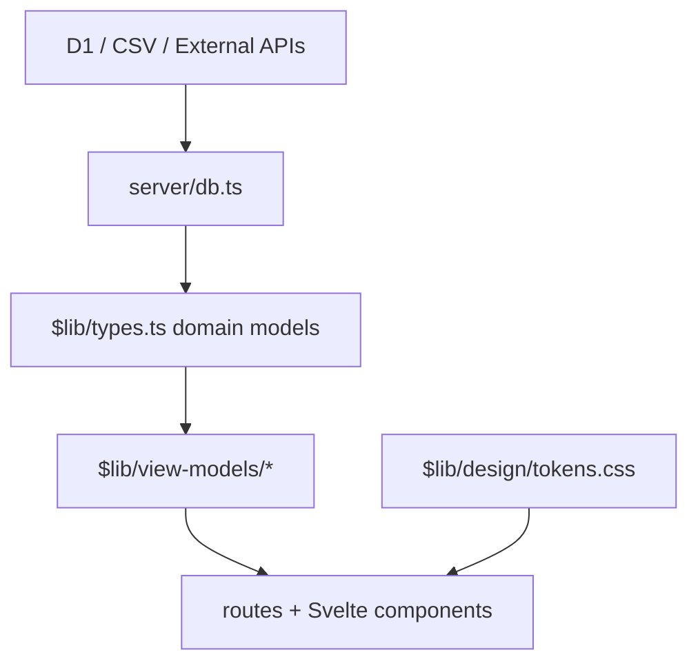

# Pocket Design System

Pocket Trips 的設計系統分成兩層：穩定的資料層，以及可以快速替換的 UI 層。D1/schema/server 回傳的資料永遠維持 domain model；畫面一律透過 view model adapter 取得可顯示資料。

Primary design reference:

- `resource/v0/Readme.md`: source of truth for philosophy, tokens, component specs, spacing, and interaction rules.
- `resource/v0/app` and `resource/v0/components`: reference implementation only. The production app is SvelteKit, so React/Next components are ported rather than copied directly.

## Design Principles

1. **Data first, UI replaceable**
   - D1 欄位、server query、domain type 不因視覺版型改動。
   - UI 不直接依賴 D1 欄位命名；必須先經過 `$lib/view-models/*`。

2. **Japanese-inspired minimalism**
   - Ma: embrace negative space with generous padding and margins.
   - Wabi-sabi: beauty in simplicity, restrained palette, no decorative flourishes.
   - Shibui: subtle, understated elegance.

3. **Quiet travel utility**
   - 旅遊 app 要像口袋筆記本：留白、輕量、可讀、可快速掃描。
   - Viewer 可以漂亮，Editor 以效率與準確為優先。

4. **Scene-based UI**
   - 同一筆 trip item 可以有不同 presentation：
     - viewer timeline
     - map marker
     - modal/detail sheet
     - expense ledger
     - packing/cart planning
   - 不在資料庫為每個 UI 場景硬開欄位，除非該欄位是長期穩定的旅行資料。

5. **CJK-friendly typography**
   - 中文大標不可只依賴西文字型 fallback。
   - Display 字體使用繁中可讀字體優先，再 fallback 到 serif。

## Visual Language

The current source of truth is `resource/v0/Readme.md`.

### Palette

- `--color-background`: warm cream, `oklch(0.975 0.005 80)`
- `--color-foreground`: deep charcoal, `oklch(0.18 0.01 60)`
- `--color-card`: paper white, `oklch(0.99 0.003 80)`
- `--color-muted`: light stone, `oklch(0.94 0.008 75)`
- `--color-muted-foreground`: stone gray, `oklch(0.45 0.01 60)`
- `--color-accent`: terracotta, `oklch(0.52 0.12 35)`
- `--color-border`: subtle divider, `oklch(0.90 0.006 80)`

### Shape

- Default radius is crisp: `2px`
- Cards are flat, paper-like, and use subtle borders.
- Avoid decorative nested cards. Use sections, rows, dividers, and quiet panels.

### Typography

- Sans: UI controls, metadata, labels.
- Mono: dates, status, small uppercase labels, tab labels.
- Display/serif: page titles and selected editorial emphasis.

## Component Rules From v0

### Bottom Navigation

- Fixed bottom.
- Height: `64px` plus safe area.
- Background: card with 95% opacity and blur.
- Icon: 20px.
- Label: 9px mono uppercase.
- Active color: accent.

### Day Carousel

- Centered day indicators with previous/next controls.
- Date uses light numerals.
- Label uses uppercase mono.
- Active day uses accent color.

### Timeline Item

- Time appears before the content card.
- Active item is full opacity and uses accent border/icon.
- Inactive item remains visible but subdued.
- Tags use mono uppercase badges.
- Notes are shown only for selected item and use a subtle accent left border.

### Homepage Trip Card

- Card padding: 16-24px.
- Background: card.
- Border: border/50.
- Hover border: accent/30.
- Status badge uses tag style.

### Motion

- Transitions are slow enough to feel calm: `300ms - 500ms`.
- Use opacity and color transitions more than layout motion.

## Architecture

## Folder Rules

- `$lib/types.ts`
  - Stable domain model.
  - Mirrors long-lived travel concepts, not temporary UI choices.

- `$lib/server/*`
  - Data access, auth, external APIs.
  - Never import Svelte components or UI helpers.

- `$lib/view-models/*`
  - Converts domain model into screen-ready data.
  - This is where category labels, icon ids, display date ranges, summary lines, and cost labels are composed.

- `$lib/design/*`
  - Design tokens, shared UI constants, primitive naming.
  - No trip business logic.

- `src/routes/*`
  - Page composition only.
  - Should become thinner over time.

## UI Replacement Contract

When replacing UI:

1. Keep routes and server loaders stable unless navigation itself changes.
2. Add or update a view model instead of reading raw `detailJson` across many Svelte files.
3. Prefer adding a new presentation adapter over mutating domain types.
4. Remove old UI CSS only after the new screen has equivalent route coverage.
5. Keep locked/private trip behavior outside visual redesign.

## Route Names

The v0 UI uses:

- Trip list: `/`
- Plan: `/trips/[slug]`
- Map: `/trips/[slug]/map`
- Expense: `/trips/[slug]/expense`
- Package: `/trips/[slug]/package`
- Cart: `/trips/[slug]/cart`

Existing compatibility routes may remain temporarily:

- `/trips/[slug]/budget`
- `/trips/[slug]/pack`

## Next Migration Steps

1. Port v0 design tokens into `tokens.css`.
2. Build Svelte view-model adapters.
3. Rewrite home and plan viewer using the v0 layout.
4. Add `expense`, `package`, and `cart` routes.
5. Gradually reconnect D1 detail fields per screen.
